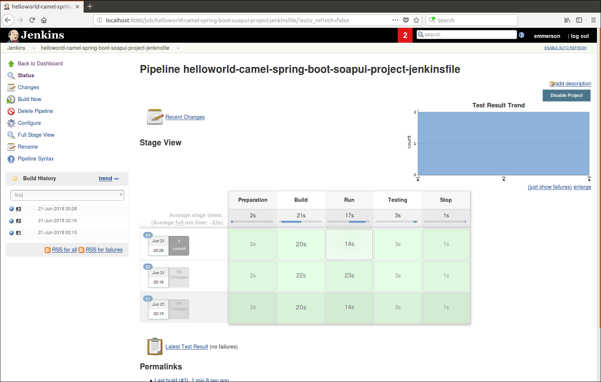
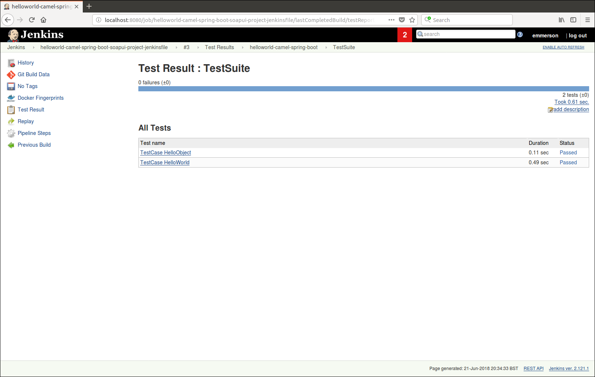

# helloworld-camel-spring-boot-soapui-project-jenkinsfile
This pipeline does following actions:
- download source code from git
- build and package with maven (generate the docker container as well)
- start the container created before
- run SOAPUI test project
- stop the container

## pipeline status example

## Test results output

