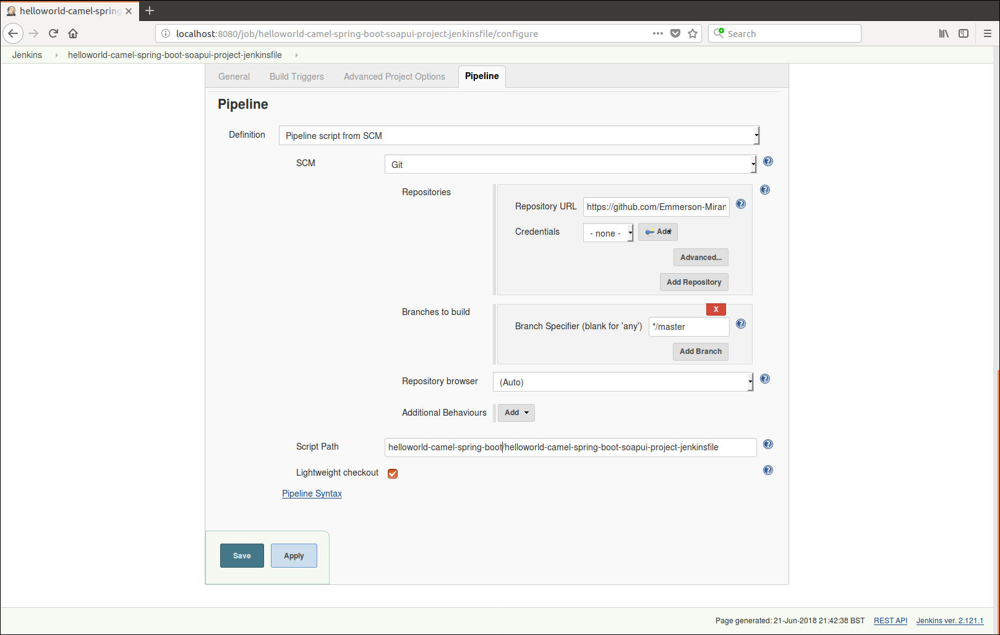
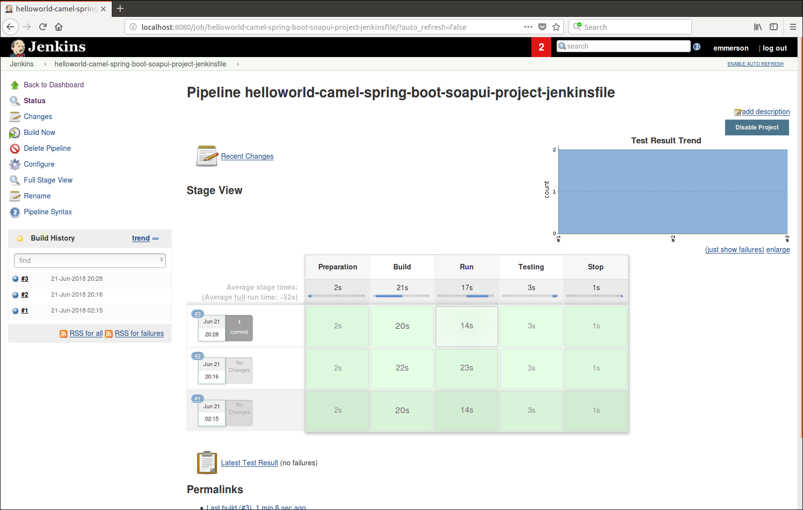
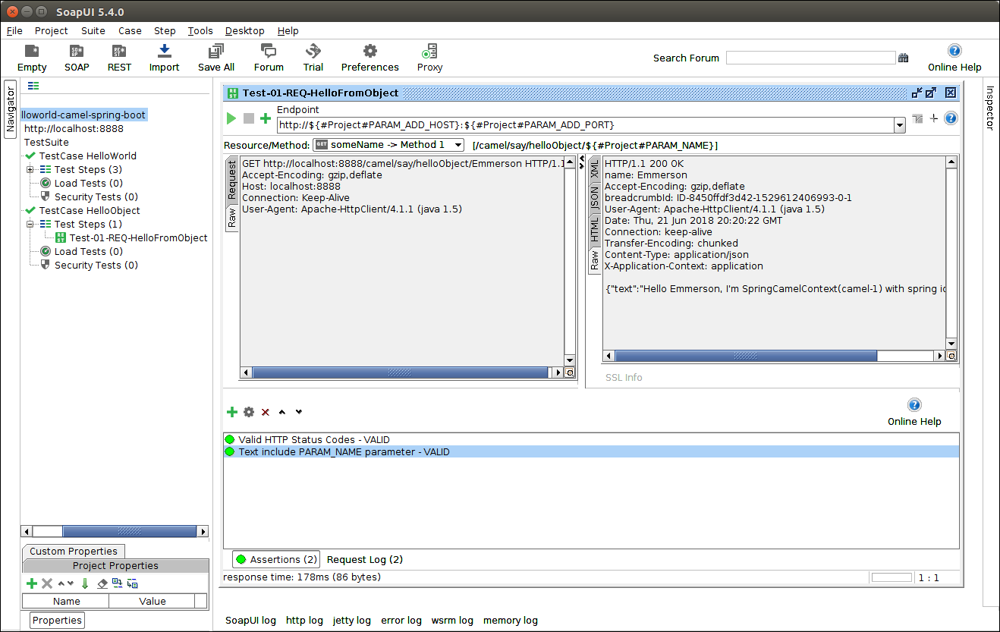
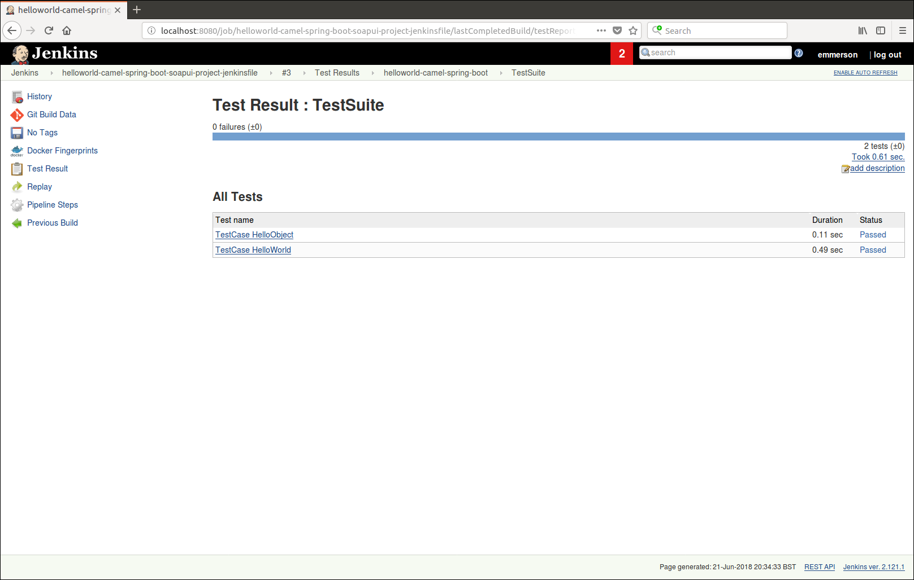

# helloworld-camel-spring-boot-soapui-project-jenkinsfile
This pipeline is composed by four stages:
- Preparation: Clean workspace and download the source code from git server.
- Build: Build source code, generate the docker image and read POM xml file.
- Run: get an unused TCP port, start the container and wait until the microservice is started
- Testing: Run test cases implemented with SOAPUI against the microservice
- Stop: Stop the microservice

## Pipeline configuration

## Pipeline status example

## SOAPUI project

## Test results output

